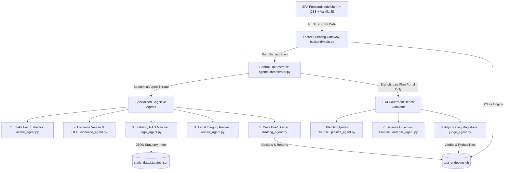

# LawEdAI — Comprehensive MVP Implementation Walkthrough

LawEdAI is a cooperative, multi-agent pre-filing legal case-building and courtroom simulation platform tailored to the Indian Legal System. It bridges the gap between everyday citizens or legal practices and the complex transitioning landscape of the **Bharatiya Nyaya Sanhita (BNS)**, **Bharatiya Nagarik Suraksha Sanhita (BNSS)**, and **Bharatiya Sakshya Adhiniyam (BSA)**.

---

## 1. Architectural Overview

The system is built on a modern decoupled stack designed to operate cloud-first with an offline-fallback/simulation mode that requires zero initial setup.



---

## 2. Specialized Cognitive Agents

We implemented **8 specialized legal agents** structured to communicate via the shared SQLAlchemy Session context:

1. **Intake Fact Extractor Agent (`intake_agent.py`)**  
   Presents high-fidelity parses of semantic incident details. Extracts involved amounts, suspect identities, exact dates, and jurisdictional coordinates.
2. **Evidence Verifier & OCR Agent (`evidence_agent.py`)**  
   Scans incoming files and assigns a structural Support Rating (`High`, `Medium`, `Low`). Highlights digital chain-of-custody compliance.
3. **Statutory RAG Matcher Agent (`legal_agent.py`)**  
   Performs vector-like keyword searches against our structured statutory corpus `static_data/statutes.json`.
4. **Legal Integrity Review Agent (`review_agent.py`)**  
   Validates case completeness. Intercepts files lacking official digital verification certificates, automatically enforcing **BSA Section 63** compliance flags.
5. **Case Brief Drafter Agent (`drafting_agent.py`)**  
   Generates the ready-made citizen case preparation brief including formal prayer of relief.
6. **Prosecution opening Counsel Agent (`plaintiff_agent.py`)**  
   Formulates an aggressive legal backing for the complainant. Maps factual findings directly to substantive code thresholds.
7. **Defense Counsel Adversarial Objection Agent (`defense_agent.py`)**  
   Challenges the filing logic. Exploits statutory procedural gaps (e.g. arguing lack of digital signature certification).
8. **Judicial Adjudicator Agent (`judge_agent.py`)**  
   Acts as the Hon'ble Magistrate. Aggregates case indices, computes a critical probability rating (%), and drafts the preliminary judicial docket.

---

## 3. Database Schema (`models.py`)

All states are persisted using a lightweight database schema:

- `CaseSubmission`: Keeps track of grievance descriptions, user portal modes (`individual` or `lawfirm`), win probabilities, and judge verdicts.
- `FactExtraction`: Holds parsed structured facts, timelines, and suspect definitions in standardized JSON lists.
- `LegalReference`: Stores sections mapped during RAG runs, cataloging the title, type (BNS/BNSS/BSA), punishment, and procedure.
- `EvidenceItem`: Tracks filename, path, mime type, and OCR support ratings.
- `CourtDebateLog`: Sequences the simulated Plaintiff vs. Defense courtroom transcript.
- `CaseDraft`: Holds structured citizen brief documents or law firm strategic reports.
- `ReviewFlag`: Contains warning checks regarding digital certificate deficiencies.

---

## 4. Premium SPA Interface

The single-page application is implemented in a premium dark slate-purple-gold mesh gradient aesthetics (`index.html`, `index.css`, `app.js`):

- **Workspace Portal Switcher**: Instant transition between the *Individual (Citizen) Portal* and the *Law Firm Arena*.
- **Pulsing Agent Arena Track**: An interactive loading progress widget showing sequential statuses as the 8 agents boot, run, and complete.
- **Simulated Courtroom Bench**: Dynamic chat bubbles sequentially typing out the prosecution and defense arguments, accompanied by a custom scroll track.
- **Case Strength Radial Gauge**: Custom HSL circular overlay displaying the judge's verdict probability (%) with smooth CSS transition effects.
- **Opponent litigation Strategy Alert Panel**: Sleek amber-bordered alert callouts focusing on opposing legal strategy and digital proof defects under BSA Sec 63.

---

## 5. Automated Verification Results

A rigorous testing suite covers both agents and server routing controllers. We verified local operations with an in-memory SQLite setup for agents and physical database files for endpoints.

Running the command:
```bash
PYTHONPATH=. .venv/bin/pytest -v
```

### Test Logs Outcome
```text
============================= test session starts ==============================
platform darwin -- Python 3.13.9, pytest-8.2.2, pluggy-1.6.0 -- .venv/bin/python3
cachedir: .pytest_cache
rootdir: /Users/mihir/Programming/Projects_Local/LawEdAI
plugins: anyio-4.13.0
collecting ... collected 8 items

tests/test_agents.py::test_intake_agent_extraction PASSED                [ 12%]
tests/test_agents.py::test_legal_agent_statutes_matching PASSED          [ 25%]
tests/test_agents.py::test_evidence_and_review_agents PASSED             [ 37%]
tests/test_agents.py::test_full_lawfirm_courtroom_orchestration PASSED   [ 50%]
tests/test_endpoints.py::test_create_case_endpoint PASSED                [ 62%]
tests/test_endpoints.py::test_upload_evidence_endpoint PASSED            [ 75%]
tests/test_endpoints.py::test_case_list_and_delete_endpoints PASSED      [ 87%]
tests/test_endpoints.py::test_full_analysis_and_dashboard_retrieval PASSED [100%]

======================== 8 passed, 17 warnings in 8.43s ========================
```

---

## 6. How to Run Locally

### Start the Gateway Server
Run the following terminal command from the project root:
```bash
.venv/bin/uvicorn backend.main:app --reload --host 0.0.0.0 --port 8000
```

### Accessing the SPA Dashboard
1. Open your browser and navigate to [http://localhost:8000](http://localhost:8000).
2. To test with live models, click **Configure LLM Keys (BYOK)** in the sidebar footer and insert your Groq or OpenAI key (safe in localStorage).
3. Enter a mock online fraud transaction details, attach a fake receipt image, and trigger the mapping sequence to see the live multi-agent court simulation!
