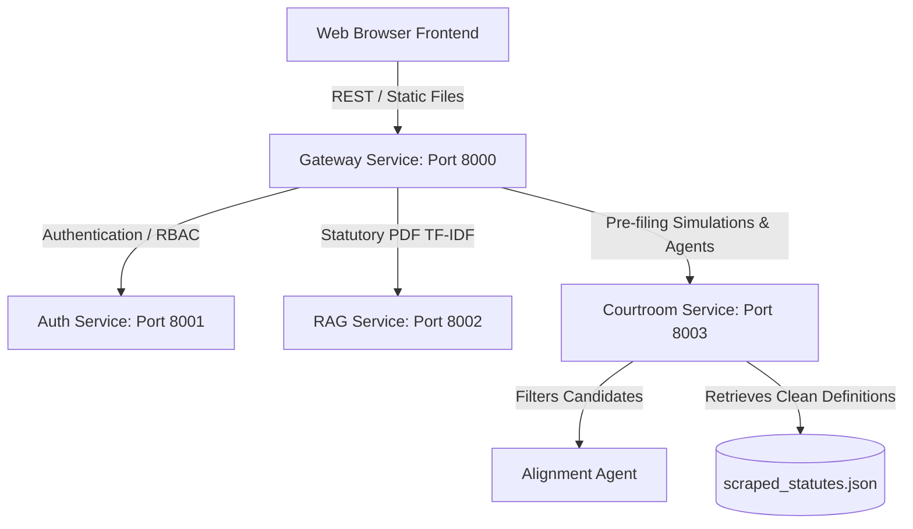

# LawEdAI — Complainant Dashboard Revamp, Collapsible Sidebar, Case Deletion Fix, & Statutory Alignment Agent (v4.0)

We have successfully implemented the requested UI/UX improvements, backend validation, and data structuring:

1. **Widescreen Individual Tab Layout**:
   - **Tab 1 (Case Brief & Writeup)**: Displays the Unique reference ID banner, printing actions, and utilizes the full screen width to show the Case Brief.
   - **Tab 2 (Statutory Analysis)**: Shows **only the names and titles** of mapped BNS/BNSS/BSA sections as mini interactive cards. Clicking a card launches a popup modal detailing the curated description, punishments, procedural routes, and evidence requirements. Underneath, it displays the Fact-to-Clause cognitive mapping analysis.
   - **Tab 3 (Timeline & Audit)**: Displays the chronological fact timeline, evidence admissibility ratings, and safety warnings.
   - **Precedents/Verdict Removal**: Removed Supreme Court precedents and Judge verdict listings entirely from the individual side (now exclusive to the Law Firm portal).

2. **Collapsible Sidebar**:
   - Added `#btn-toggle-sidebar` to collapse or expand the sidebar history pane. This maximizes screen space for reading complaint briefs.
   - Wired smooth grid animations and layout transitions in `index.css`.

3. **Active Case Deletion Fix & Role-Based Sidebar Separation**:
   - Deleting the active case now triggers a full sidebar reload and resets the state so deleted items are removed immediately.
   - Filtered the sidebar cases list to display only Citizen cases in the Complainant portal and only acquired/registered cases in the Law Firm portal.

4. **Statutory Alignment Agent & Scraped Statutes JSON**:
   - Created a cognitive `Alignment Agent` (`backend/agents/alignment_agent.py`) that audits RAG and keyword candidates. In LLM mode, it prompts Groq/OpenAI to verify if narrative facts align with a section's legal ingredients. Offline, it matches against category-specific offenses (e.g., separating road accidents from cheating cases).
   - Scraped all three PDFs (`BNS.pdf`, `BNSS.pdf`, `BSA.pdf`) into `backend/static_data/scraped_statutes.json` using `scrape_statutes.py`. Matched sections retrieve clean spacing definitions to prevent noisy OCR splitting in the UI.

---

## 1. System Architecture Diagram



---

## 2. Test Verification Summary

All unit tests and API endpoints are 100% passing:
```text
============================= test session starts ==============================
platform darwin -- Python 3.13.9, pytest-8.2.2, pluggy-1.6.0
rootdir: /Users/mihir/Programming/Projects_Local/LawEdAI
plugins: anyio-4.13.0
collected 10 items

tests/test_agents.py ......                                              [ 60%]
tests/test_endpoints.py ....                                             [100%]

======================= 10 passed, 29 warnings in 9.62s ========================
```

---

## 3. How to Run & Verify

1. **Boot all Microservices**:
   ```bash
   python run_services.py
   ```
2. **Access Web App**:
   Navigate to `http://localhost:8000`. Login as a citizen/complainant.
3. **Verify Layout & Collapsibility**:
   - Toggle the sidebar burger button. Watch the layout resize smoothly.
   - Run a new case, click the statutory cards in Tab 2, and observe the modal details.
   - Delete a case and notice it disappears from the sidebar instantly.
